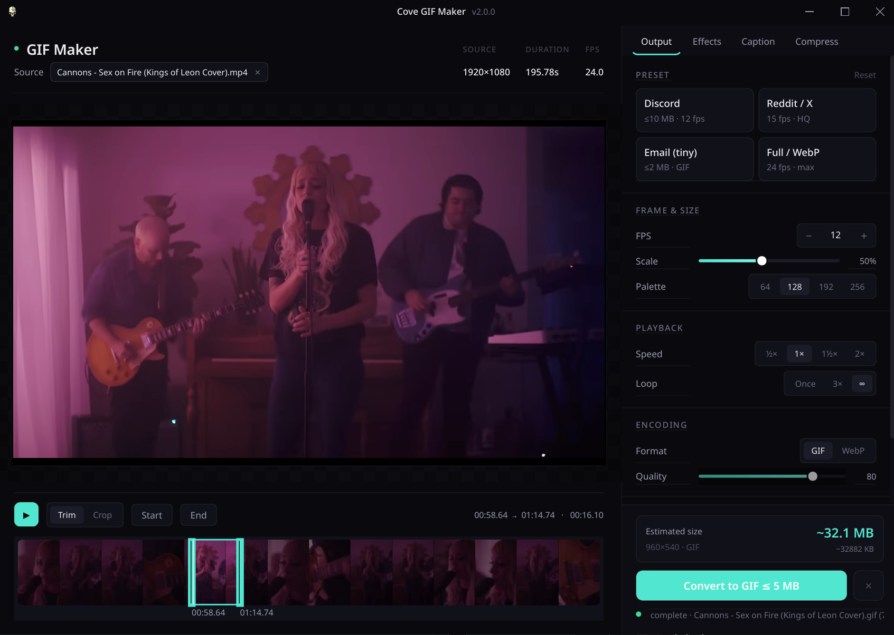
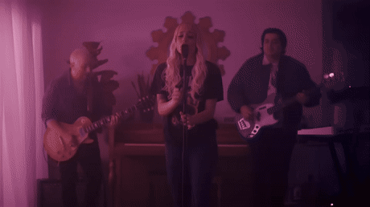

# Cove GIF Maker

A focused desktop tool: drop a video, trim it on a visual timeline, crop it
with a draggable rectangle, and convert it to an optimized GIF or WebP. Built
with [PySide6](https://wiki.qt.io/Qt_for_Python) and `ffmpeg` two-pass palette
rendering. Fully offline, no cloud, no accounts.

One codebase, one repository, native builds for both platforms: a Windows
installer + portable exe, and a Linux AppImage + .deb. Every `v*` tag cuts
all four artifacts via GitHub Actions.




---

## Features

- **Frameless window** — custom title bar with Windows-style controls, centered
  title, and full-bleed chrome. Cove design palette + tokens throughout.
- **Drop or click to load** any video — MP4, MKV, WebM, MOV, AVI, M4V, MPG, WMV.
- **Embedded preview** — click to play / pause, spacebar shortcut.
- **Visual trim bar** — thumbnail strip with draggable Start / End handles and
  a scrubbable playhead.
- **GUI crop tool** — toggle Crop, drag a rectangle directly on the preview.
  Rule-of-thirds guides, 8 resize handles, dimmed mask outside the selection.
- **Transparency (MP4 → transparent emote)** — MP4 can't carry an alpha
  channel, so an emote saved from Discord or Tenor arrives with its cutout
  flattened onto a flat backdrop. Cove detects that backdrop on load and keys
  it back out, with a Tolerance / Edge blend pair and an eyedropper for
  awkward sources. Paired with the **Discord Emote** preset for a 128 px,
  ≤ 256 KB transparent GIF.
- **Caption overlay** — add up to 2 text captions per export with drag-to-move,
  corner-resize, and rotate handle on the preview. Rendered as PNG overlays
  (works around static ffmpeg's missing drawtext filter).
- **Right-rail layout** — Output, Effects, and Caption tabs replace the old
  single settings column. Custom Stepper, Segmented, EffectRow, PresetCard,
  and CoveSlider widgets.
- **Real-time progress + ETA** — parsed from ffmpeg's progress stream.
- **GIF or WebP output** (WebP is now the default), with FPS (8/12/15/24),
  scale (25/50/75/100 %), palette (64–256 colors), speed (0.5x–2x), and
  loop count controls.
- **Two-pass palette generation** for clean colors at small file sizes; a
  `gifsicle` post-pass shaves another 10–30 % when available.
- **Open output folder** — one-click button opens the output directory in your
  file manager (xdg-open / Explorer / Finder).

---

## Install a prebuilt release

Head to the [Releases page](https://github.com/Sin213/cove-gif-maker/releases)
and grab the artifact for your OS:

| OS      | Artifact                                   | Notes                                         |
| ------- | ------------------------------------------ | --------------------------------------------- |
| Windows | `cove-gif-maker-<version>-Setup.exe`       | Inno Setup installer (Start Menu + Desktop)   |
| Windows | `cove-gif-maker-<version>-Portable.exe`    | Single-file, no install                       |
| Linux   | `Cove-GIF-Maker-<version>-x86_64.AppImage` | `chmod +x` and run                            |
| Linux   | `cove-gif-maker_<version>_amd64.deb`       | `sudo apt install ./cove-gif-maker_*.deb`     |

`ffmpeg` and `ffprobe` are **bundled inside every artifact**. `gifsicle` is
optional — if present on PATH (or bundled on Windows), it runs the final
GIF-optimization pass; otherwise the app just skips that step.

> **Windows SmartScreen** may warn on first launch because the exe isn't
> signed. Click **More info → Run anyway**.

---

## Usage



1. Drop a video anywhere in the window (or click the empty area to browse).
2. Drag the blue Start / End handles on the trim bar — or use the **Start** /
   **End** buttons to set them at the playhead.
3. Click **Crop** to toggle the crop overlay; drag corners / edges to size,
   drag inside to move, **Reset** clears it.
4. Switch to the **Caption** tab to add text overlays — drag to position,
   corner handles to resize, rotation handle to angle. Up to 2 per export.
5. Pick FPS, scale, palette size, speed, loop count, and format in the
   **Output** tab on the right rail.
6. Click **Convert** and choose where to save. Progress + ETA appears in the
   bottom bar. Use **Open Folder** to jump to the output directory.

Drop a different video at any time — even on top of the playing preview — to
start over.

### Making a transparent Discord emote

Emotes downloaded from Discord or Tenor come down as `.mp4`, and MP4 has no
alpha channel — whatever was transparent got flattened onto the site's flat
backdrop (Tenor's is `#32323A`). Keying that color back out restores the
cutout:

1. Drop the MP4 in. Cove samples the border of the first frame and reports
   what it found under **Effects → Transparency** — e.g. *"Detected #32323A
   backdrop (84 % of the border)"*.
2. Click the **Discord Emote** preset in the Output tab. That sets GIF at
   128 px on the longest side, 15 fps, and a 256 KB cap, and switches the
   transparency toggle on — Discord's animated-emoji uploader accepts GIF
   and PNG only, never WebP.
3. Convert. Upload the result under *Server Settings → Emoji*.

If the detected color is wrong, or the source has no flat border for Cove to
sample, hit **Pick** and click the background directly in the preview.

- **Tolerance** widens the range of colors treated as background. Raise it
  when specks of backdrop survive around the subject; lower it when parts of
  the subject start disappearing.
- **Edge blend** feathers the cutout boundary. Higher is softer.
- **Auto-detect** re-samples at the current trim start — useful when the
  clip fades in from a different color.

### Tips

- **Scale** is the single biggest lever for file size — try 50 % first.
- **12–15 FPS** looks fine for most reaction GIFs and is much smaller than 24.
- **Palette 128** is a good default; drop to 64 for solid-color content.
- For longer / higher-motion clips, prefer **WebP** — typically 30–60 %
  smaller than GIF at similar quality.
- Transparent GIF alpha is 1-bit — a pixel is either fully there or fully
  gone. WebP keeps the soft edge, so prefer it anywhere outside Discord's
  emoji uploader.
- If a transparent emote can't hit 256 KB at 128 px, the target-size pass
  will shrink it below 128. Trim the clip shorter or drop to 12 fps first —
  both cost less than resolution does.

---

## Running from source (Linux)

Python 3.10+. On Arch:

```bash
sudo pacman -S python pyside6 ffmpeg gifsicle
python -m venv .venv
.venv/bin/pip install -r requirements.txt
PYTHONPATH=src .venv/bin/python -m cove_gif_maker
```

On Debian / Ubuntu:

```bash
sudo apt install python3 python3-pyside6.qtwidgets ffmpeg gifsicle
python3 -m venv .venv
.venv/bin/pip install -r requirements.txt
PYTHONPATH=src .venv/bin/python -m cove_gif_maker
```

---

## Running from source (Windows)

Python 3.10+ from [python.org](https://www.python.org/downloads/) (tick
**"Add python.exe to PATH"** during install).

```powershell
py -m venv .venv
.venv\Scripts\pip install -r requirements.txt

# ffmpeg via winget…
winget install Gyan.FFmpeg
# …or drop ffmpeg.exe + ffprobe.exe (and optionally gifsicle.exe)
# somewhere on PATH.

$env:PYTHONPATH = "src"
.venv\Scripts\python -m cove_gif_maker
```

---

## Building release artifacts yourself

PyInstaller can't cross-compile, so each platform has its own script. Both
download ffmpeg automatically.

### Linux — AppImage + .deb

```bash
VERSION=2.0.0 bash scripts/build-release.sh
# Output in release/:
#   Cove-GIF-Maker-2.0.0-x86_64.AppImage
#   cove-gif-maker_2.0.0_amd64.deb
```

### Windows — Setup.exe + Portable.exe

Requires [Inno Setup 6](https://jrsoftware.org/isdl.php) (pre-installed on
GitHub Actions' `windows-latest`). The Windows build also bundles
`gifsicle.exe`.

```powershell
.\build.ps1 -Version 2.0.0
# Output in release\:
#   Cove-GIF-Maker-2.0.0-Setup.exe
#   Cove-GIF-Maker-2.0.0-Portable.exe
```

### Wine cross-compile (Windows builds on Linux)

Requires Docker with `tobix/pywine:3.12` and `amake/innosetup`.

```bash
bash .winebuild/build-windows.sh
# Output in release/:
#   Cove-GIF-Maker-2.0.0-Setup.exe
#   Cove-GIF-Maker-2.0.0-Portable.exe
```

### Automated release via GitHub Actions

Push a tag matching `v*` (e.g. `v2.0.0`) and `.github/workflows/release.yml`
runs the Linux + Windows jobs in parallel and attaches all four artifacts to
the GitHub Release created for the tag.

---

## How it works

```
src/cove_gif_maker/
├── __main__.py          entry point
├── app.py               main window, wiring, event filters
├── chrome.py            frameless window chrome + title bar
├── controls.py          Stepper, Segmented, EffectRow, PresetCard, CoveSlider
├── theme.py             Cove palette, design tokens, stylesheet
├── timeline.py          custom trim-bar widget (thumbnails + handles)
├── crop_overlay.py      draggable crop rect with rule-of-thirds guides
├── caption_overlay.py   drag/resize/rotate caption handles on the preview
├── caption_render.py    PNG overlay rendering for caption text
├── keying.py            backdrop-color detection + eyedropper sampling
├── batch.py             batch export support
├── prefs.py             persistent user preferences
├── thumbnails.py        QThread worker for ffmpeg frame extraction
├── converter.py         QThread worker for the GIF / WebP pipeline
├── ffmpeg_utils.py      ffprobe wrapper + ffmpeg command builders, cross-
│                        platform binary resolution (PATH or bundled)
├── updater.py           GitHub release version checker
└── assets/cove_icon.png

packaging/
├── installer.iss           Inno Setup script
├── launcher.py             PyInstaller entry point
└── cove-gif-maker.desktop  Linux desktop entry

build.ps1                   Windows Setup.exe + Portable.exe builder
scripts/build-release.sh    Linux AppImage + .deb builder
.winebuild/                 Wine cross-compile for Windows builds on Linux
.github/workflows/          Cross-platform release CI
```

The conversion pipeline uses ffmpeg's two-pass palette flow:

1. **Palette generation** — `palettegen` analyzes the trimmed clip and produces
   an optimal N-color palette.
2. **Render** — `paletteuse` applies that palette with Sierra-2-4A dithering.
3. **Optimize** — `gifsicle -O3` shaves a final pass when available.

With transparency on, a `format=rgba,colorkey=…` step is spliced in after the
crop and before the scale — after the crop so it only touches kept pixels, and
before the scale so the downscale resamples the alpha channel into a smooth
edge. `palettegen` then holds a slot back with `reserve_transparent=1` and
`paletteuse` collapses the feathered alpha to GIF's 1-bit channel at
`alpha_threshold`. WebP takes the same keyed stream but encodes it as `bgra`,
whose lossless alpha avoids the `alpha=1`-instead-of-`0` background that
`yuva420p`'s lossy alpha leaves behind.

Progress is parsed from `ffmpeg -progress pipe:1` for steady incremental
updates, and ETA is derived from elapsed wall time vs. completion percentage
with an EMA smoother.

---

## Credits

- [Qt for Python (PySide6)](https://wiki.qt.io/Qt_for_Python) — UI toolkit.
- [FFmpeg](https://ffmpeg.org/) — every video frame and color palette.
- [gifsicle](https://www.lcdf.org/gifsicle/) — final GIF optimization.
- [Inno Setup](https://jrsoftware.org/isinfo.php) — the `Setup.exe` installer.

---

## Licensing

- Cove GIF Maker is **MIT** — see `LICENSE`.
- The bundled `ffmpeg` / `ffprobe` binaries are the **gyan.dev
  release-essentials** (Windows) and **johnvansickle.com static** (Linux)
  builds, both **GPLv3**. Cove GIF Maker shells out to these binaries rather
  than linking, so the app's MIT licensing stands. If you redistribute release
  artifacts, comply with the ffmpeg GPL terms — most commonly by keeping
  `FFMPEG-LICENSE.txt` alongside the binary and pointing recipients at
  [ffmpeg.org](https://ffmpeg.org/) for sources.
- `gifsicle` (Windows build only) is licensed under the **GPLv2**. Source and
  license at [lcdf.org/gifsicle](https://www.lcdf.org/gifsicle/).
